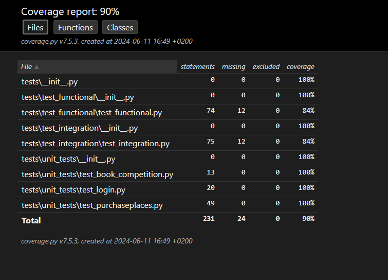
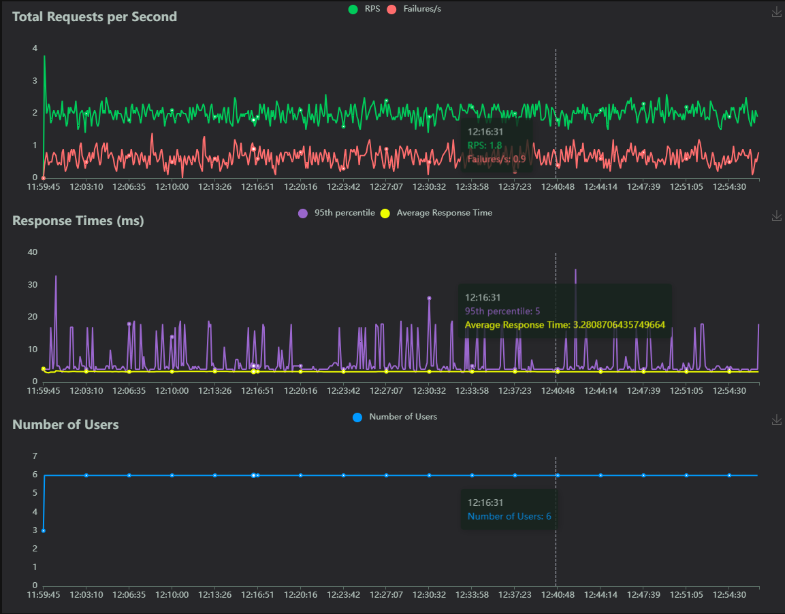

# Projet 11 gudlift


# gudlift


Plateforme de réservation de places à des compétitions de force pour l'entreprise Güdlft.

L'objectif du projet est de corriger les erreurs et bugs présents dans le projet 
[Python_Testing](https://github.com/OpenClassrooms-Student-Center/Python_Testing), 
ainsi que d'implémenter de nouvelles fonctionnalités. Chaque correction / ajout se trouve sur sa propre branche, 
et est supporté(e) par une suite de tests via Pytest et Locust.

## Initialisation du projet

### Windows :
```
git clone https://github.com/canofranck/P11_OC_Gudlft_Ameliorez-_application_Web_tests_et_debogage


python -m venv env 
env\Scripts\activate

pip install -r requirements.txt
```

### MacOS et Linux :
```
git clone https://github.com/canofranck/P11_OC_Gudlft_Ameliorez-_application_Web_tests_et_debogage


python3 -m venv env 
source env/bin/activate

pip install -r requirements.txt
```


## Utilisation

1. Lancer le serveur Flask :

```
$env:FLASK_APP = "server.py"
flask run
```

2. Pour accéder au site, se rendre sur l'adresse par défaut : [http://127.0.0.1:5000/](http://127.0.0.1:5000/)


## Tests

- **Note : Tous les packages nécessaires à l'exécution de ces tests sont inclus dans 'requirements.txt'.**

### Tests unitaires / tests d'intégration

Les tests unitaires, fonctionnel et d'intégration sont exécutés grâce à Pytest

Pour effectuer l'ensemble des tests unitaires et d'intégration, entrer la commande :
```
pytest tests
```


### Test de performances

Il est possible d'effectuer un test de performance grâce au module [Locust](https://locust.io) 
Pour lancer le serveur de test, entrer la commande :

```
locust -f tests/test_performance/locustfile.py   
```

Se rendre sur l'adresse [http://localhost:8089](http://localhost:8089) et entrer les options souhaitées, avec pour 'host' l'adresse par défaut du site (http://127.0.0.1:5000/).


### Rapports



